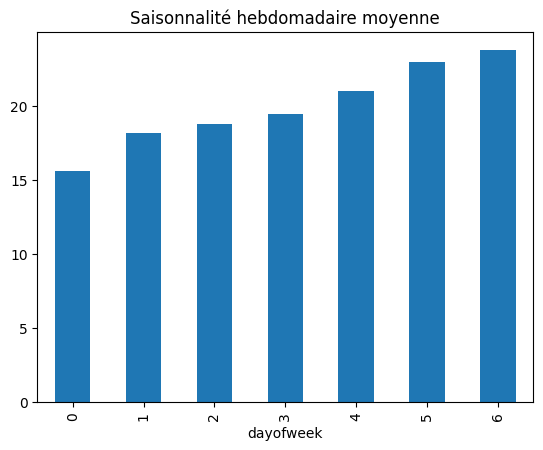

# Prévision de la demande retail

Ce projet a pour objectif de prédire la demande de produits dans le secteur du retail afin d’optimiser les stocks, réduire les ruptures et améliorer la planification.  
Il inclut un notebook d’analyse, des visualisations et un modèle de prévision.

---

##  Méthodologie

- Préparation et nettoyage des données  
- Analyse exploratoire (EDA)  
- Visualisations des tendances et saisonnalités  
- Modélisation (ARIMA, Prophet, ou autre modèle choisi)  
- Évaluation des performances  
- Interprétation des résultats

---

##  Résultats clés

Les résultats seront complétés après l’importation des graphiques :

- Visualisation des tendances de la demande  
- Analyse des variations saisonnières  
- Performance du modèle de prévision  
- Insights pour l’optimisation des stocks  

---

## Technologies utilisées

- Python  
- Pandas, NumPy  
- Matplotlib, Seaborn  
- Scikit-learn / Statsmodels / Prophet  
  
##  Résultats clés

### Saisonnalité de la demande
Ce graphique montre les variations saisonnières observées dans les données, permettant d’identifier les périodes de forte et faible demande.

---

### Vente quotidiennes
Ce graphique illustre l’évolution des ventes au jour le jour, utile pour visualiser les tendances, les pics d’activité et les irrégularités.

---
##  Conclusion

Ce projet met en évidence l’importance de la prévision de la demande dans le retail pour optimiser les stocks et réduire les ruptures.  
L’analyse exploratoire et les visualisations ont permis d’identifier des tendances claires, ainsi que des variations saisonnières significatives.  
Le modèle de prévision fournit une base solide pour anticiper les ventes et améliorer la prise de décision opérationnelle.

##  Auteur

**Bourhane Bedja Ben Ahmed **  
Master 2 MIASHS – Data Science & Statistiques  
Université Lumière Lyon 2  

